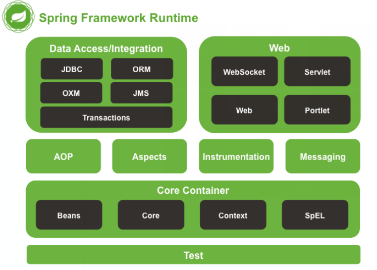

# Spring 框架

## spring 框架的概述以及 spring 中基于 XML 的 IOC 配置

### spring 的概述

- spring 是什么
  - Spring 是分层的 Java SE/EE 应用 full-stack 轻量级开源框架，以 IoC（Inverse Of Control：反转控制）和 AOP（Aspect Oriented Programming：面向切面编程）为内核，提供了展现层 Spring MVC 和持久层 Spring JDBC 以及业务层事务管理等众多的企业级应用技术，还能整合开源世界众多著名的第三方框架和类库，逐渐成为使用最多的 Java EE 企业应用开源框架。
- spring 的两大核心
  - IoC（Inverse Of Control：反转控制）
  - AOP（Aspect Oriented Programming：面向切面编程）
- spring 的发展历程和优势
  - 优势
    - 方便解耦，简化开发
    - AOP 编程的支持
    - 声明式事务的支持
    - 方便程序的测试
    - 方便集成各种优秀框架
    - 降低 JavaEE API 的使用难度
    - Java 源码是经典学习范例
- spring 体系结构
  

### 程序的耦合及解耦

> 耦合是影响软件复杂程度和设计质量的一个重要因素，在设计上我们应采用以下原则：如果模块间必须存在耦合，就尽量使用数据耦合，少用控制耦合，限制公共耦合的范围，尽量避免使用内容耦合。

#### 耦合性的概念

耦合性（Coupling），也叫耦合度，是**对模块间关联程度的度量**。耦合的强弱取决于模块间接口的复杂性、调用模块的方式以及通过界面传送数据的多少。模块间的耦合度是指模块之间的依赖关系，包括控制关系、调用关系、数据传递关系。模块间联系越多，其耦合性越强，同时表明其独立性越差（降低耦合性，可以提高其独立性）。

在软件工程中，耦合指的就是就是**对象之间的依赖性**。对象之间的耦合越高，维护成本越高。因此对象的设计应使类和构件之间的耦合最小。软件设计中通常用耦合度和内聚度作为衡量模块独立程度的标准。

> 划分模块的一个准则就是高内聚低耦合。

#### 耦合的分类

- 内容耦合
  - 当一个模块直接修改或操作另一个模块的数据时，或一个模块不通过正常入口而转入另一个模块时，这样的耦合被称为内容耦合。
  - 内容耦合是最高程度的耦合，应该避免使用之。
- 公共耦合
  - 两个或两个以上的模块共同引用一个全局数据项，这种耦合被称为公共耦合。
  - 在具有大量公共耦合的结构中，确定究竟是哪个模块给全局变量赋了一个特定的值是十分困难的。
- 外部耦合
  - 一组模块都访问同一全局简单变量而不是同一全局数据结构，而且不是通过参数表传递该全局变量的信息，则称之为外部耦合。
- 控制耦合
  - 一个模块通过接口向另一个模块传递一个控制信号，接受信号的模块根据信号值而进行适当的动作，这种耦合被称为控制耦合。
- 标记耦合
  - 若一个模块 A 通过接口向两个模块 B 和 C 传递一个公共参数，那么称模块 B 和 C 之间存在一个标记耦合。
- 数据耦合
  - 模块之间通过参数来传递数据，那么被称为数据耦合。
  - 数据耦合是最低的一种耦合形式，系统中一般都存在这种类型的耦合，因为为了完成一些有意义的功能，往往需要将某些模块的输出数据作为另一些模块的输入数据。
- 非直接耦合
  - 两个模块之间没有直接关系，它们之间的联系完全是通过主模块的控制和调用来实现的。

#### 内聚与耦合

内聚标志**一个模块内各个元素彼此结合的紧密程度**，它是信息隐蔽和局部化概念的自然扩展。内聚是从功能角度来度量模块内的联系，一个好的内聚模块应当恰好做一件事。它**描述的是模块内的功能联系**。耦合是软件结构中各模块之间相互连接的一种度量，**耦合强弱取决于模块间接口的复杂程度、进入或访问一个模块的点以及通过接口的数据**。 程序讲究的是**低耦合，高内聚**。就是同一个模块内的各个元素之间要高度紧密，但是各个模块之间的相互依存度却要不那么紧密。

内聚和耦合是密切相关的，同其他模块存在高耦合的模块意味着低内聚，而高内聚的模块意味着该模块同其他模块之间是低耦合。在进行软件设计时，应力争做到高内聚，低耦合。

#### 工厂模式解耦

在实际开发中我们可以把三层的对象都使用配置文件配置起来，当启动服务器应用加载的时候，让一个类中的方法通过读取配置文件，把这些对象创建出来并存起来。在接下来的使用的时候，直接拿过来用就好了。

这个读取配置文件，创建和获取三层对象的类就是工厂。

### IOC 的概念和 Spring 中的 IOC

#### IOC 的概念

> 控制反转(Inversion of Control， IOC)把创建对象的权力交给框架，是框架的重要特性，并非面向对象编程的专用术语。
> 包括依赖注入(Dependency injection, DI)和依赖查找(Dependency Lookup)

#### IOC 的作用

削减计算机程序的耦合(解除我们代码中的依赖关系)

#### spring 中基于 XML 的 IOC 环境搭建

##### bean 标签

- 作用
  - 用于配置对象让 spring 来创建的。
  - 默认情况下它调用的是类中的无参构造函数。如果没有无参构造函数则不能创建成功。
- 属性：
  - id：给对象在容器中提供一个唯一标识。用于获取对象。
  - class：指定类的全限定类名。用于反射创建对象。默认情况下调用无参构造函数。
  - scope：指定对象的作用范围。
    - singleton :默认值，单例的.
    - prototype :多例的.
    - request :WEB 项目中,Spring 创建一个 Bean 的对象,将对象存入到 request 域中.
    - session :WEB 项目中,Spring 创建一个 Bean 的对象,将对象存入到 session 域中.
    - global session :WEB 项目中,应用在 Portlet 环境.如果没有 Portlet 环境那么 globalSession 相当于 session.
  - init-method：指定类中的初始化方法名称。
  - destroy-method：指定类中销毁方法名称。

##### bean 的作用范围和生命周期

- 单例对象：scope="singleton"
  - 作用范围：
    - 一个应用只有一个对象的实例。它的作用范围就是整个引用。
  - 生命周期
    - 对象出生：当应用加载，创建容器时，对象就被创建了。
    - 对象活着：只要容器在，对象一直活着。
    - 对象死亡：当应用卸载，销毁容器时，对象就被销毁了。
- 多例对象：scope="prototype"
  - 作用范围：
    - 每次访问对象时，都会重新创建对象实例
  - 生命周期：
    - 对象出生：当使用对象时，创建新的对象实例。
    - 对象活着：只要对象在使用中，就一直活着。
    - 对象死亡：当对象长时间不用时，被 java 的垃圾回收器回收了。

### 依赖注入（Dependency Injection）

#### 依赖注入的概念

依赖注入：Dependency Injection。它是 spring 框架核心 ioc 的具体实现。
我们的程序在编写时，通过控制反转，把对象的创建交给了 spring，但是代码中不可能出现没有依赖的情况。ioc 解耦只是降低他们的依赖关系，但不会消除。例如：我们的业务层仍会调用持久层的方法。
那这种业务层和持久层的依赖关系，在使用 spring 之后，就让 spring 来维护了。
简单的说，就是坐等框架把持久层对象传入业务层，而不用我们自己去获取。

#### 构造函数注入

#### set 方法注入

#### 使用 p 名称空间注入数据（本质还是调用 set 方法）

#### 注入集合属性

##### List 结构的

- array
- list
- set

##### Map 结构的

- map
- entry
- props
- prop

## spring 中基于注解的 IOC 以及的 ioc 的案例

### spring 中 IOC 的常用注解

#### 有关配置的注解

- @Configuration
  - 作用：指定当前类是一个配置类
- @ComponentScan
  - 作用：用于通过注解指定 spring 在创建容器时要扫描的包
  - 属性：
    - value：用于指定创建容器时要扫描的包
    - basePackages：同 value
- @Bean
  - 作用：用于把当前方法的返回值作为 bean 对象存入 spring 的 IOC 容器中
  - 属性：
    - name：用于指定 bean 的 id，默认值是当前方法的名称
  - 细节：当我们使用注解配置方法是使，如果方法有参数，spring 框架会去容器中查找有没有可用的 bean 对象。查找的方法和 AutoWired 相同
- @Import
  - 作用：用于导入其他配置类
    - 属性
      - value：用于指定待导入配置类的字节码
- @PropertySource
  - 作用：用于加载 .properties 文件中的配置
  - 属性：
    - value：指定文件的名称和路径
    - 关键字：classpath，表示类路径下

#### 资源管理

- @Component
  - 作用：用于把当前类对象存入 spring 容器中
  - 属性：
    - value：用于指定 bean 的 id。当我们不写时，默认值为当前类名，且首字母小写。
- @Controller：表现层
- @Service：业务层
- @Repository：持久层
  - 以上三个注解的作用和属性与 Component 相同
  - 他们三个是 spring 框架为我们提供明确的三层框架的使用的注解，使我们的三层对象更加清晰

#### 注入数据

- @AutoWired
  - 作用：自动按照类型注入。
    - 只要容器中有唯一的一个 bean 对象类型和要注入的变量类型匹配就可以注入成功
    - 如果 IOC 容器中没有任何 bean 类型和要注入的变量类型匹配，则报错
    - 如果 IOC 容器中有多个 bean 类型匹配时，实现根据 type 查找，然后根据 name 查找对应的 id，如果找不到对应的 id，则报错
  - 出现的位置：可以时变量上，也可以是方法上。
  - 细节：
    - 在使用注解注入时，set 方法就不是必须的了
- @Qualifier
  - 作用：在按照类型注入的基础之上，再按照名称注入。他在给类成员注入时不能单独使用，但在给方法参数注入时可以单独使用。
  - 属性：
    - value：用于指定注入 bean 的 id
- @Resource
  - 作用：直接按照 bean 的 id 注入，可以单独使用
  - 属性： - name：用于指定 bean 的 id，当只有一个 bean 时，可以不指定

> 以上三种注入都只能注入其他 bean 类型的数据，而基本类型和 String 类型无法使用上述注解

- @Value
  - 作用：用于注入基本类型和 String 类型的数据
  - 属性： - value：用于指定数据的值，可以使用 spring 中的 SpEL 表达式

> 集合类型的注入只能通过 XML 实现

#### 用于改变作用范围

- @Scope
  - 作用：用于指定 bean 的作用范围
  - 属性：
    - value：指定范围的取值，默认 singleton

#### 用于改变生命周期

- @PreDestroy
  - 作用：用于指定销毁方法
- @PostConstruct
  - 作用：用于指定初始化方法

## Spring 整合 JUnit

1. 使用 @RunWith 注解替换原有运行器
   - @RunWith(SpringJUnit4ClassRunner.class)
2. 使用 @ContextConfiguration 指定 spring 配置文件的位置
   - @ContextConfiguration(locations= {"classpath:bean.xml"})
3. 使用 @Autowired 给测试类中的变量注入数据

## spring 中的 AOP

### AOP 概述

> AOP：全称是 Aspect Oriented Programming 即：面向切面编程。

> 简单的说它就是把我们程序重复的代码抽取出来，在需要执行的时候，使用动态代理的技术，在不修改源码的基础上，对我们的已有方法进行增强。

### AOP 的实现方式

使用动态代理技术

#### 动态代理

- 特点：字节码随用随创建，随用随加载。
- 作用：不修改源码的基础上对方法增强
- 分类
  - 基于接口的动态代理
    - 提供者：JDK 官方的 Proxy 类。
    - 要求：被代理类最少实现一个接口。
  - 基于子类的动态代理
    - 提供者：第三方的 CGLib，如果报 asmxxxx 异常，需要导入 asm.jar。
    - 要求：被代理类不能用 final 修饰的类（最终类）。

### AOP 的作用及优势

- 作用：
  - 在程序运行期间，不修改源码对已有方法进行增强。
- 优势：
  - 减少重复代码
  - 提高开发效率
  - 维护方便

### spring 中的 AOP 相关术语

- Joinpoint (连接点):
  - 所谓连接点是指那些被拦截到的点。在 spring 中,这些点指的是方法,因为 spring 只支持方法类型的连接点。
- Pointcut (切入点):
  - 所谓切入点是指我们要对哪些 Joinpoint 进行拦截的定义。
- Advice (通知/增强):
  - 所谓通知是指拦截到 Joinpoint 之后所要做的事情就是通知。
  - 通知的类型：前置通知,后置通知,异常通知,最终通知,环绕通知。
- Introduction (引介):
  - 引介是一种特殊的通知在不修改类代码的前提下, Introduction 可以在运行期为类动态地添加一些方法或 Field。
- Target (目标对象):
  - 代理的目标对象。
- Weaving (织入):
  - 是指把增强应用到目标对象来创建新的代理对象的过程。
  - spring 采用动态代理织入，而 AspectJ 采用编译期织入和类装载期织入。
- Proxy (代理):
  - 一个类被 AOP 织入增强后，就产生一个结果代理类。
- Aspect (切面):
  - 是切入点和通知（引介）的结合。

### spring 中基于 XML 和注解的 AOP 配置

#### spring 中基于 XML 的 AOP 配置步骤

1. 把通知 bean 交给 spring 管理
2. 使用 aop:config 标签表明开始 AOP 的配置
3. 使用 aop:aspect 标签表明配置切面
   - id 属性：给切面提供的唯一标识
   - ref 属性：指定通知类 bean 的 id
4. 在 aop:asprct 标签的内部使用对应标签来配置通知的类型
   - aop:before —— <aop:before method="beginTransaction" pointcut-ref="pt1"/>
     - 作用：用于配置前置通知。指定增强的方法在切入点方法之前执行
     - 执行时间点：切入点方法执行之前执行
   - aop:after-returning —— <aop:after-returning method="commit" pointcut-ref="pt1"/>
     - 作用：用于配置后置通知
     - 执行时间点：切入点方法正常执行之后。它和异常通知只能有一个执行
   - aop:after-throwing —— <aop:after-throwing method="rollback" pointcut-ref="pt1"/>
     - 作用：用于配置后置通知
     - 执行时间点：切入点方法执行产生异常后执行。它和后置通知只能执行一个
   - aop:after —— <aop:after method="release" pointcut-ref="pt1"/>
     - 作用：用于配置后置通知
     - 执行时间点：无论切入点方法执行时是否有异常，它都会在其后面执行。
     - 四个标签的共同属性：
       - method：用于指定通知类中的增强方法名称
       - poinitcut：用于指定切入点表达式
       - ponitcut-ref：用于指定切入点的表达式的引用

##### 环绕通知

#### 切入点表达式说明

execution:匹配方法的执行(常用)

execution(表达式)

表达式语法：execution([修饰符] 返回值类型 包名.类名.方法名(参数))

- 写法说明：
  全匹配方式：

  ```
  public void com.xxx.service.impl.XXXServiceImpl.saveXXX(com.xxx.domain.XXX)
  ```

  访问修饰符可以省略

  ```
  void com.xxx.service.impl.XXXServiceImpl.saveXXX(com.xxx.domain.XXX)
  ```

  返回值可以使用\*号，表示任意返回值

  ```
  * com.xxx.service.impl.XXXServiceImpl.saveXXX(com.xxx.domain.XXX)
  ```

  包名可以使用\*号，表示任意包，但是有几级包，需要写几个\*

  ```
  * *.*.*.*.XXXServiceImpl.saveXXX(com.xxx.domain.XXX)
  ```

  使用..来表示当前包，及其子包

  ```
  * com..XXXServiceImpl.saveXXX(com.xxx.domain.XXX)
  ```

  类名可以使用\*号，表示任意类

  ```
  * com..*.saveXXX(com.xxx.domain.XXX)
  ```

  方法名可以使用\*号，表示任意方法

  ```
  * com..*.*( com.xxx.domain.XXX)
  ```

  参数列表可以使用\*，表示参数可以是任意数据类型，但是必须有参数

  ```
  * com..*.*(*)
  ```

  参数列表可以使用..表示有无参数均可，有参数可以是任意类型

  ```
  * com..*.*(..)
  ```

  全通配方式：

  ```
  * *..*.*(..)
  ```

- 注：通常情况下，我们都是对业务层的方法进行增强，所以切入点表达式都是切到业务层实现类。

  execution(\* com.xxx.service.impl.\*.\*(..))

#### 基于注解的 AOP 配置

## spring 中的 jdbcTemplate 以及 Spring 事务控制
